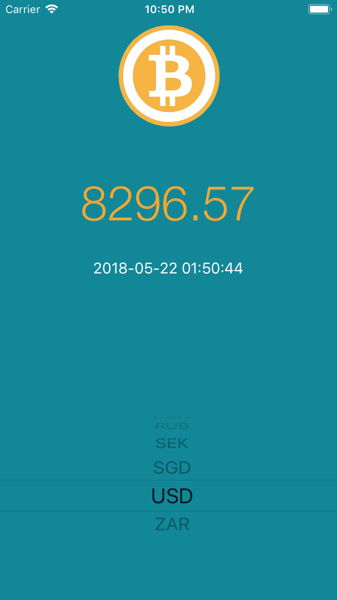

**BitcoinTicker**

This is my version of BitcoinTicker from iOS Bootcamp - <a href="https://www.udemy.com/ios-11-app-development-bootcamp">London App Brewery</a>. I decided to use the features of Swift 4, in order to remove the third party dependencies (Alamofire and SwiftyJSON)

 

Copyright © The App Brewery
